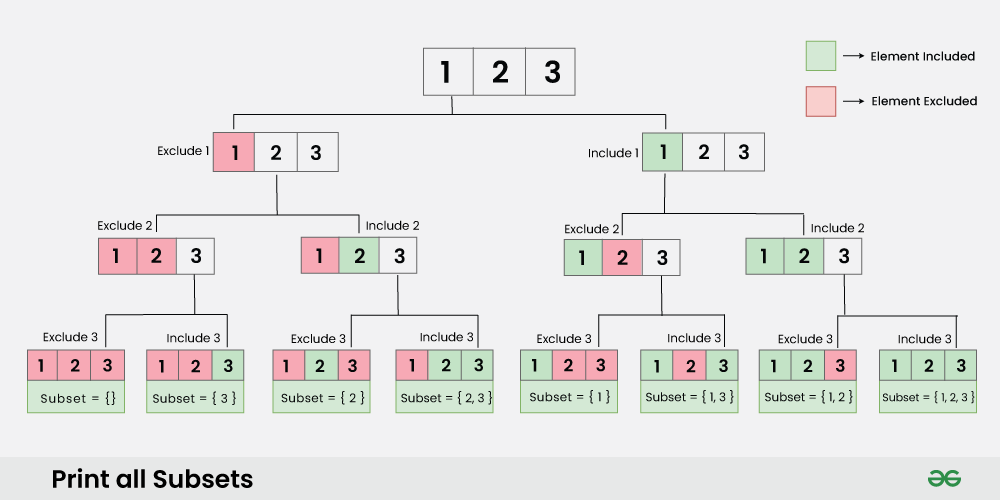

# Recursion

- Recursion is heavily used in tree, graph, DP, backtracking etc.
- We try to make input small. Actually we take a **decision which makes input smaller**.
- recursion is needed when there are **choices and decisions** present.
- Understanding recursion tree is very important. Below is recursion tree of subset problem.

## References

[[00] Recursion playlist - Aditry Verma](https://www.youtube.com/watch?list=PL_z_8CaSLPWeT1ffjiImo0sYTcnLzo-wY)
[[01] Generate all subsets of a set recursively - geeksforgeeks.org](https://www.geeksforgeeks.org/backtracking-to-find-all-subsets/)
